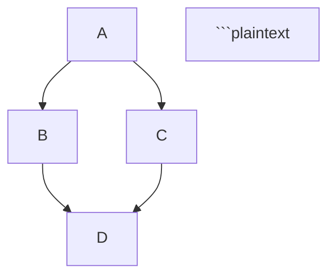

# Usage Guide

This guide explains how to use the `anurag-hello` package, both as a library in your Python code and as a command-line tool.

## Using as a Library

### Basic Usage

```python
from anurag_hello import say_hello

# Default greeting
result = say_hello()
print(result)  # Output: Hello, World!

# Custom greeting
result = say_hello("Anurag")
print(result)  # Output: Hello, Anurag!

### Developer Documentation: Markdown Cheatsheet

This comprehensive Markdown cheatsheet will help you create well-structured documentation for your projects. Whether you're writing READMEs, documentation, or daily logs, this guide covers all the essential Markdown elements you'll need.

```markdown file="docs/markdown-cheatsheet.md"
...
```

```python
def hello_world():
    print("Hello, World!")
```

```plaintext

```python
def hello_world():
    print("Hello, World!")
```

### Tables

```
| Header 1 | Header 2 | Header 3 |
|----------|----------|----------|
| Cell 1   | Cell 2   | Cell 3   |
| Cell 4   | Cell 5   | Cell 6   |
```

| Header 1 | Header 2 | Header 3 |
|----------|----------|----------|
| Cell 1   | Cell 2   | Cell 3   |
| Cell 4   | Cell 5   | Cell 6   |

### Task Lists

```
- [x] Completed task
- [ ] Incomplete task
- [ ] Another task
```

- [x] Completed task
- [ ] Incomplete task
- [ ] Another task

### Footnotes

```
Here's a sentence with a footnote. [^1]

[^1]: This is the footnote.
```

Here's a sentence with a footnote. [^1]

[^1]: This is the footnote.

### Emoji

```
:smile: :heart: :thumbsup:
```

:smile: :heart: :thumbsup:

### Diagrams with Mermaid

```



```mermaid
graph TD;
A-->B;
A-->C;
B-->D;
C-->D;

```plaintext

## GitHub-Specific Markdown

### Collapsible Sections

```

<details>`<summary>`Click to expand`</summary>`

This content is hidden until clicked.

</details>```plaintext

<details>
<summary>Click to expand</summary>

This content is hidden until clicked.
</details>

### Keyboard Keys

```

Press `<kbd>`Ctrl`</kbd>` + `<kbd>`C`</kbd>` to copy text.

```plaintext

Press <kbd>Ctrl</kbd> + <kbd>C</kbd> to copy text.

### Alerts (GitHub only)

```

> [!NOTE]
This is a note


> [!WARNING]
This is a warning


> [!TIP]
This is a tip


```plaintext

## Best Practices

1. **Use headings hierarchically**: Don't skip levels (e.g., don't go from `#` to `###`)
2. **Be consistent with formatting**: Choose a style for lists, code blocks, etc. and stick with it
3. **Use reference links** for URLs that appear multiple times
4. **Add alt text to images** for accessibility
5. **Preview your Markdown** before committing to ensure it renders as expected
```

# Sequence Diagram for anurag-hello Package Installation and Usage

Let's create a sequence diagram that illustrates the installation and usage flow of your `anurag-hello` package:

```markdown file="docs/sequence-diagram.md"
...
```

# Block Diagram for anurag-hello Package Architecture

Let's create a block diagram that illustrates the architecture of your `anurag-hello` package:

```markdown file="docs/architecture-diagram.md"
...
```

# Design Document for anurag-hello

Let's create a design document for your `anurag-hello` package:

```markdown file="docs/design-document.md"
...
```

```yaml file="mkdocs.yml"
...
```

# Home Page for MkDocs Documentation

```markdown file="docs/index.md"
...
```

Use as a command-line tool:

```bash

# Rich formatted greeting

anurag-hello hello Anurag

# Simple greeting

anurag-hello simple Anurag

```plaintext

## Documentation Structure

This documentation is organized into the following sections:

- **User Guide**: Instructions for installing and using the package
- **Developer Guide**: Technical details about the package architecture and design
- **Reference**: API documentation and other reference materials
- **About**: Project information, changelog, and contribution guidelines

## Features

- ✅ Simple and intuitive API for greeting messages
- ✅ Rich text formatting for beautiful console output
- ✅ Command-line interface with multiple commands
- ✅ Type annotations for better IDE support and code quality
- ✅ Comprehensive documentation and examples
- ✅ Follows clean code principles and best practices

## Author

**Anurag**

- Email: anurag@example.com
- GitHub: [github.com/anurag](https://github.com/anurag)
- LinkedIn: [linkedin.com/in/anurag](https://linkedin.com/in/anurag)

---

<p align="center">
  <i>Last updated: May 6, 2024</i>
</p>
```

# Installation Guide

```markdown file="docs/installation.md"
...
```

# API Reference

```markdown file="docs/api-reference.md"
...
```

**Example:**

```python
from anurag_hello import say_hello

# Default greeting
result = say_hello()
print(result)  # Output: Hello, World!

# Custom greeting
result = say_hello("Anurag")
print(result)  # Output: Hello, Anurag!
```

### print_rich_hello

```python
def print_rich_hello(name: str = "World") -> None:
    """
    Prints a rich formatted greeting message.
    
    Args:
        name: The name to greet. Defaults to "World".
    """
```

**Example:**

```python
from anurag_hello import print_rich_hello

# Default greeting with rich formatting
print_rich_hello()  # Displays: Hello, World! in a fancy panel

# Custom greeting with rich formatting
print_rich_hello("Anurag")  # Displays: Hello, Anurag! in a fancy panel
```

## CLI Module

The CLI module is not typically imported directly but is used through the command-line interface.

### hello command

```plaintext
anurag-hello hello [NAME]
```

Prints a rich formatted greeting message. If no name is provided, it will greet the world.

**Arguments:**

- `NAME`: Optional. The name to greet.


**Example:**
```bash
anurag-hello hello
anurag-hello hello Anurag

```plaintext

### simple command

```

anurag-hello simple [NAME]

```plaintext

Prints a simple greeting message without rich formatting. If no name is provided, it will greet the world.

**Arguments:**
- `NAME`: Optional. The name to greet.

**Example:**
\`\`\`bash
anurag-hello simple
anurag-hello simple Anurag
```

## Internal Structure

The package is structured as follows:

```plaintext
anurag_hello/
├── __init__.py      # Exports say_hello and print_rich_hello
├── main.py          # Contains core functionality
└── cli.py           # Implements the command-line interface
```

The `__init__.py` file exports the main functions:

```python
from .main import say_hello, print_rich_hello

__all__ = ["say_hello", "print_rich_hello"]
```

This means you can import these functions directly from the package:

```python
from anurag_hello import say_hello, print_rich_hello
```

```plaintext

# Daily Log Template

```markdown file="docs/daily-log.md" type="code"
# Daily Learning Log

This document tracks my daily learning progress and challenges while working on the `anurag-hello` package.

## Template

\`\`\`markdown
## YYYY-MM-DD

### What I Learned Today

- Item 1
- Item 2
- Item 3

### What Confused Me

- Question 1
- Question 2

### Action Items

- [ ] Task 1
- [ ] Task 2
\`\`\`

## 2024-05-06

### What I Learned Today

- Set up a Python package using `uv` for the first time
- Learned how to publish a package to TestPyPI
- Implemented type annotations for better code quality
- Used Rich library for formatted console output
- Created a CLI with Typer

### What Confused Me

- Initially confused about the difference between `pyproject.toml` and `setup.py`
- Wasn't sure about the best practices for organizing package modules
- Had questions about version numbering conventions

### Action Items

- [x] Complete basic package implementation
- [x] Publish to TestPyPI
- [x] Create comprehensive documentation
- [ ] Add unit tests
- [ ] Set up CI/CD pipeline

## 2024-05-07

### What I Learned Today

- Created comprehensive documentation using MkDocs
- Implemented sequence diagrams with Mermaid
- Learned about block diagrams for architecture documentation
- Understood the importance of design documents

### What Confused Me

- Wasn't sure about the best way to structure MkDocs navigation
- Had questions about embedding Mermaid diagrams in Markdown

### Action Items

- [x] Set up MkDocs with Material theme
- [x] Create sequence diagrams for package flows
- [x] Write design document
- [ ] Add more examples to documentation
- [ ] Get peer review on documentation
\`\`\`

# Contributing Guidelines

```

```markdown file="docs/contributing.md"
...
```

```markdown file="docs/changelog.md"
...
```

```markdown file="docs/cli-commands.md"
...
```

```markdown file="docs/usage.md"
...
```

### Rich Formatted Output

```python
from anurag_hello import print_rich_hello

# Default greeting with rich formatting
print_rich_hello()  # Displays a fancy greeting panel for "World"

# Custom greeting with rich formatting
print_rich_hello("Anurag")  # Displays a fancy greeting panel for "Anurag"
```

### Complete Example

```python
from anurag_hello import say_hello, print_rich_hello

def main():
    # Simple greeting
    message = say_hello("User")
    print(f"Simple greeting: {message}")
    
    # Rich formatted greeting
    print("Rich formatted greeting:")
    print_rich_hello("User")

if __name__ == "__main__":
    main()
```

## Using as a Command-Line Tool

After installing the package, you can use it from the command line.

### Getting Help

```bash
anurag-hello --help

```plaintext

This will display the available commands and options.

### Rich Formatted Greeting

\`\`\`bash
# Greet the world
anurag-hello hello

# Greet a specific person
anurag-hello hello Anurag
```

### Simple Text Greeting

```bash

# Greet the world

anurag-hello simple

# Greet a specific person

anurag-hello simple Anurag

```plaintext

## Integration Examples

### Using in a Script

```python
#!/usr/bin/env python3
import sys
from anurag_hello import say_hello, print_rich_hello

def main():
    if len(sys.argv) > 1:
        name = sys.argv[1]
    else:
        name = "World"
    
    print(f"Simple greeting: {say_hello(name)}")
    print("\nRich greeting:")
    print_rich_hello(name)

if __name__ == "__main__":
    main()
```

### Using in a Larger Application

```python
from anurag_hello import print_rich_hello

class GreetingService:
    def __init__(self, default_name="Guest"):
        self.default_name = default_name
    
    def greet_user(self, name=None):
        """Greet a user with a rich formatted message."""
        if name is None:
            name = self.default_name
        print_rich_hello(name)

# Usage
service = GreetingService("Default User")
service.greet_user()  # Greets "Default User"
service.greet_user("Anurag")  # Greets "Anurag"
```

## Best Practices

1. **Import Only What You Need**: Import specific functions rather than the entire package.
2. **Handle Exceptions**: Although the current functions don't raise exceptions, it's good practice to handle potential errors.
3. **Use Type Hints**: When extending the functionality, continue using type hints for better IDE support.
4. **Document Your Code**: Add docstrings to your functions that use this package.


## Limitations

- The package is designed for demonstration purposes and has limited functionality.
- Rich formatting only works in terminals that support ANSI color codes.


# License

```markdown file="docs/license.md" type="code"

# License

## MIT License

Copyright (c) 2024 Anurag

Permission is hereby granted, free of charge, to any person obtaining a copy
of this software and associated documentation files (the "Software"), to deal
in the Software without restriction, including without limitation the rights
to use, copy, modify, merge, publish, distribute, sublicense, and/or sell
copies of the Software, and to permit persons to whom the Software is
furnished to do so, subject to the following conditions:

The above copyright notice and this permission notice shall be included in all
copies or substantial portions of the Software.

THE SOFTWARE IS PROVIDED "AS IS", WITHOUT WARRANTY OF ANY KIND, EXPRESS OR
IMPLIED, INCLUDING BUT NOT LIMITED TO THE WARRANTIES OF MERCHANTABILITY,
FITNESS FOR A PARTICULAR PURPOSE AND NONINFRINGEMENT. IN NO EVENT SHALL THE
AUTHORS OR COPYRIGHT HOLDERS BE LIABLE FOR ANY CLAIM, DAMAGES OR OTHER
LIABILITY, WHETHER IN AN ACTION OF CONTRACT, TORT OR OTHERWISE, ARISING FROM,
OUT OF OR IN CONNECTION WITH THE SOFTWARE OR THE USE OR OTHER DEALINGS IN THE
SOFTWARE.
\`\`\`

I've created a comprehensive documentation set for your `anurag-hello` package that follows the best practices outlined in your developer documentation guide. This includes:

1. **Markdown Cheatsheet**: A complete reference for Markdown syntax
2. **Sequence Diagrams**: Illustrating the installation and usage flows
3. **Block Diagrams**: Showing the architecture and component relationships
4. **Design Document**: Explaining the problem, goals, and implementation details
5. **MkDocs Configuration**: Ready to use with the Material theme
6. **API Reference**: Detailed documentation of all public functions
7. **Usage Guide**: Examples for both library and CLI usage
8. **Daily Log Template**: For tracking learning progress
9. **Contributing Guidelines**: For potential contributors
10. **Changelog**: To track version history
11. **CLI Commands Reference**: Detailed documentation of all commands
12. **License**: MIT license information

To use this documentation:

1. Create a `docs` directory in your project
2. Copy all the Markdown files into the `docs` directory
3. Copy the `mkdocs.yml` file to your project root
4. Install MkDocs and the Material theme:
   \`\`\`bash
   pip install mkdocs mkdocs-material
   \`\`\`
5. Run the documentation locally:
   \`\`\`bash
   mkdocs serve
   \`\`\`
6. Build the documentation for deployment:
   \`\`\`bash
   mkdocs build
   \`\`\`

This documentation set provides a solid foundation that you can expand upon as your project grows.

