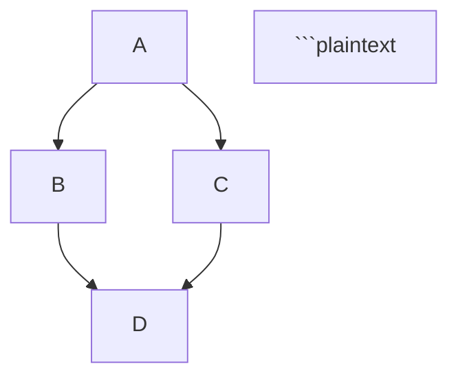

# API Reference

This page documents the public API of the `anurag-hello` package.

## Core Module

### say_hello

```python
def say_hello(name: str = "World") -> str:
    """
    Returns a greeting message for the given name.
    
    Args:
        name: The name to greet. Defaults to "World".
        
    Returns:
        A greeting string.
    """
### print_rich_hello

```python
def print_rich_hello(name: str = "World") -> None:
    """
    Prints a rich formatted greeting message.
    
    Args:
        name: The name to greet. Defaults to "World".
    """
```
**Example:**

```python
from anurag_hello import print_rich_hello

# Default greeting with rich formatting
print_rich_hello()  # Displays: Hello, World! in a fancy panel

# Custom greeting with rich formatting
print_rich_hello("Anurag")  # Di
```
### Developer Documentation: Markdown Cheatsheet

This comprehensive Markdown cheatsheet will help you create well-structured documentation for your projects. Whether you're writing READMEs, documentation, or daily logs, this guide covers all the essential Markdown elements you'll need.

```markdown file="docs/markdown-cheatsheet.md"
...
```

```python
def hello_world():
    print("Hello, World!")
```

```plaintext

```python
def hello_world():
    print("Hello, World!")
```

### Tables

```
| Header 1 | Header 2 | Header 3 |
|----------|----------|----------|
| Cell 1   | Cell 2   | Cell 3   |
| Cell 4   | Cell 5   | Cell 6   |
```

| Header 1 | Header 2 | Header 3 |
|----------|----------|----------|
| Cell 1   | Cell 2   | Cell 3   |
| Cell 4   | Cell 5   | Cell 6   |

### Task Lists

```
- [x] Completed task
- [ ] Incomplete task
- [ ] Another task
```

- [x] Completed task
- [ ] Incomplete task
- [ ] Another task

### Footnotes

```
Here's a sentence with a footnote. [^1]

[^1]: This is the footnote.
```

Here's a sentence with a footnote. [^1]

[^1]: This is the footnote.

### Emoji

```
:smile: :heart: :thumbsup:
```

:smile: :heart: :thumbsup:

### Diagrams with Mermaid

```



```mermaid
graph TD;
A-->B;
A-->C;
B-->D;
C-->D;

```plaintext

## GitHub-Specific Markdown

### Collapsible Sections

```

<details>`<summary>`Click to expand`</summary>`

This content is hidden until clicked.

</details>```plaintext

<details>
<summary>Click to expand</summary>

This content is hidden until clicked.
</details>

### Keyboard Keys

```

Press `<kbd>`Ctrl`</kbd>` + `<kbd>`C`</kbd>` to copy text.

```plaintext

Press <kbd>Ctrl</kbd> + <kbd>C</kbd> to copy text.

### Alerts (GitHub only)

```

> [!NOTE]
This is a note


> [!WARNING]
This is a warning


> [!TIP]
This is a tip


```plaintext

## Best Practices

1. **Use headings hierarchically**: Don't skip levels (e.g., don't go from `#` to `###`)
2. **Be consistent with formatting**: Choose a style for lists, code blocks, etc. and stick with it
3. **Use reference links** for URLs that appear multiple times
4. **Add alt text to images** for accessibility
5. **Preview your Markdown** before committing to ensure it renders as expected
```

# Sequence Diagram for anurag-hello Package Installation and Usage

Let's create a sequence diagram that illustrates the installation and usage flow of your `anurag-hello` package:

```markdown file="docs/sequence-diagram.md"
...
```

# Block Diagram for anurag-hello Package Architecture

Let's create a block diagram that illustrates the architecture of your `anurag-hello` package:

```markdown file="docs/architecture-diagram.md"
...
```

# Design Document for anurag-hello

Let's create a design document for your `anurag-hello` package:

```markdown file="docs/design-document.md"
...
```

```yaml file="mkdocs.yml"
...
```

# Home Page for MkDocs Documentation

```markdown file="docs/index.md"
...
```

Use as a command-line tool:

```bash

# Rich formatted greeting

anurag-hello hello Anurag

# Simple greeting

anurag-hello simple Anurag

```plaintext

## Documentation Structure

This documentation is organized into the following sections:

- **User Guide**: Instructions for installing and using the package
- **Developer Guide**: Technical details about the package architecture and design
- **Reference**: API documentation and other reference materials
- **About**: Project information, changelog, and contribution guidelines

## Features

- ✅ Simple and intuitive API for greeting messages
- ✅ Rich text formatting for beautiful console output
- ✅ Command-line interface with multiple commands
- ✅ Type annotations for better IDE support and code quality
- ✅ Comprehensive documentation and examples
- ✅ Follows clean code principles and best practices

## Author

**Anurag**

- Email: anurag@example.com
- GitHub: [github.com/anurag](https://github.com/anurag)
- LinkedIn: [linkedin.com/in/anurag](https://linkedin.com/in/anurag)

---

<p align="center">
  <i>Last updated: May 6, 2024</i>
</p>
```

# Installation Guide

```markdown file="docs/installation.md"
...
```

# API Reference

```markdown file="docs/api-reference.md"
...
```

**Example:**

```python
from anurag_hello import say_hello

# Default greeting
result = say_hello()
print(result)  # Output: Hello, World!

# Custom greeting
result = say_hello("Anurag")
print(result)  # Output: Hello, Anurag!
```

### print_rich_hello

```python
def print_rich_hello(name: str = "World") -> None:
    """
    Prints a rich formatted greeting message.
    
    Args:
        name: The name to greet. Defaults to "World".
    """
```

**Example:**

```python
from anurag_hello import print_rich_hello

# Default greeting with rich formatting
print_rich_hello()  # Displays: Hello, World! in a fancy panel

# Custom greeting with rich formatting
print_rich_hello("Anurag")  # Displays: Hello, Anurag! in a fancy panel
```

## CLI Module

The CLI module is not typically imported directly but is used through the command-line interface.

### hello command

```plaintext
anurag-hello hello [NAME]
```

Prints a rich formatted greeting message. If no name is provided, it will greet the world.

**Arguments:**

- `NAME`: Optional. The name to greet.


**Example:**
```bash
anurag-hello hello
anurag-hello hello Anurag

```plaintext

### simple command

```

anurag-hello simple [NAME]

```plaintext

Prints a simple greeting message without rich formatting. If no name is provided, it will greet the world.

**Arguments:**
- `NAME`: Optional. The name to greet.

**Example:**
\`\`\`bash
anurag-hello simple
anurag-hello simple Anurag
```

## Internal Structure

The package is structured as follows:

```plaintext
anurag_hello/
├── __init__.py      # Exports say_hello and print_rich_hello
├── main.py          # Contains core functionality
└── cli.py           # Implements the command-line interface
```

The `__init__.py` file exports the main functions:

```python
from .main import say_hello, print_rich_hello

__all__ = ["say_hello", "print_rich_hello"]
```

This means you can import these functions directly from the package:

```python
from anurag_hello import say_hello, print_rich_hello
```

```plaintext

# Daily Log Template

```markdown file="docs/daily-log.md" type="code"
# Daily Learning Log

This document tracks my daily learning progress and challenges while working on the `anurag-hello` package.

## Template

\`\`\`markdown
## YYYY-MM-DD

### What I Learned Today

- Item 1
- Item 2
- Item 3

### What Confused Me

- Question 1
- Question 2

### Action Items

- [ ] Task 1
- [ ] Task 2
\`\`\`

## 2024-05-06
```
